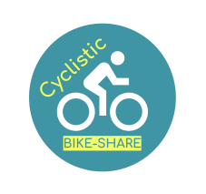

# About Me

Results-driven Statistics undergraduate with a strong passion for data analysis and a solid foundation in mathematical principles. Proficient in using statistical software packages like R and Python to manipulate and visualize data. Skilled in hypothesis testing, regression analysis, and experimental design. Seeking opportunities to apply my analytical skills in a dynamic and data-centric environment to contribute to evidence-based decision-making and problem-solving. Eager to leverage my knowledge and enthusiasm for statistics to excel in a career that combines data science and real-world applications.

## Projects

### Google Data Analytics Capstone - Case Study: Bike Share

Designed a new marketing strategy to convert casual riders into annual members using R. This data-driven approach that's backed up with compelling data insights and professional data visualizations led to better understanding of how casual riders and annual members use Cyclistic bikes differently. The case-study can be accessed [here](https://github.com/RifqiHafizuddin/Google-Data-Analytics-Capstone-Bike-Share/)

### Data Mining Project - Text Analysis

[][webdev]

can be accessed [here](https://github.com/RifqiHafizuddin/DataMiningProject/blob/main/Kasus_Klasifikasi_Kelompok_1.ipynb)

### Programming Languages and Tools

[][webdev]
[][webdev]
[][webdev]
[][webdev]

 

### Connect With Me:

&nbsp;&nbsp;

[webdev]: https://github.com/RifqiHafizuddin/rifqihafizuddin.github.io/
